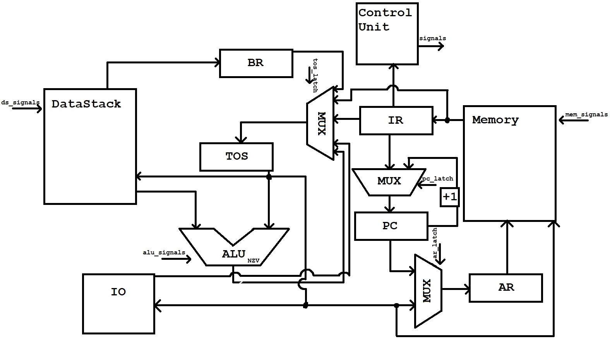

# Лабараторная работа №3

---
Шикунов Максим Евгеньевич P3233
`forth | stack | neum | mc | tick | struct | stream | port | pstr | prob2`
Выполнен базовый вариант

## Язык программирования

---

### Синтаксис

__Форма Бэкуса-Наура:__

``` форма Бэкуса-Наура
<program> ::= <term> | <term> "\n" <program>
<term> ::= <variables> | <words> | <call_words>
<variables> ::= <make_variable> | <set_variable> | <variable_on_top_stack>
<make_variable> ::= "VARIABLE" <string_name>
<string_name> ::= [A-Za-z][A-Za-z0-9]*
<set_variable> ::= <number> <string_name> "!"
<number> ::= -?[1-9][0-9]*
<variable_on_top_stack> ::= <string_name> "@"
<words> ::= ":" <string_name> <description> "\n" <commands> ";"
<description> ::= "(" <type> "--" <string_name> ")"
<type> ::= <string_name>
<commands> ::= <command> | <command> "\n" <commands>
<command> ::= "+" | "-" | "*" | "/" | "mod" | "dup" | "drop" | "swap"
           | "=" | ">" | "<" | "." | "exit" | <variables> | <if> | <if_else | <loop>
<if> ::= "if" <term> "then"
<if_else> ::= "if" <term> "else" <term> "then"
<loop> ::= "begin" <term> "until"
```

### Особенности языка

- Используется обратная польская запись для вычислений
- Все переменные хранятся в стеке
- Forth не имеет объявления типов данных
- Есть целочисленные и строковые литералы

### Операции

| __Операции__ | __Стек__                     | __Описание__                                                                       |
|-------------|------------------------------|------------------------------------------------------------------------------------|
| +           | (... a b) --> (... a + b)    | Складываем два верхних числа со стека и кладем на вершину сумму                    |
| -           | (... a b) --> (... a - b)    | Вычитаем из a число b и кладем разность на вершину                                 |
| *           | (... a b) --> (... a * b)    | Умножаем два верхних числа со стека и кладем на вершину результат                  |
| /           | (... a b) --> (... a / b)    | Делим a на число b и кладем результат на вершину стека                             |
| mod         | (... a b) --> (... a mod b)  | Кладем остаток от деления a на b на вершину стека                                  |
| dup         | (... a) --> (... a a)        | Дублирует число с вершины стека и кладет дубликат на вершину                       |
| drop        | (... a) --> (...)            | Удаляет число с вершины стека                                                      |
| swap        | (... a b) --> (... b a)      | Меняет местами два числа, которые лежат на вершине стека                           |
| =           | (... a b) --> (... a = b)    | Если a равно b, то кладем 1 на вершину стека, иначе 0                              |
| \>          | (... a b) --> (... a > b)    | Если b больше a, то кладем 1 на вершину стека, иначе 0                             |
| \<          | (... a b) --> (... a < b)    | Если b меньше a, то кладем 1 на вершину стека, иначе 0                             |
| .           | (... a) --> output(a)        | Печатаем вершину стека в output как число                                          |
| exit        | -                            | Завершаем программу                                                                |
| (a addr) !  | (...)\[addr\] = a            | Сохраняет a по адресу (addr)                                                       |
| (addr) @ | (...)\[addr\] --> (... a)    | Кладет на вершину стека число, которое лежит по адресу                             |
| # | input --> ...a               | Считывает значение из input и кладет на вершину стека                              |
| if | a == True ip++, jmp n        | Если на вершине стека True, то перейдем далее, иначе перейдем на else или endif    |
| else | -                            | Если при команде if на стеке лежало False, то программа перейдет сюда              |
| endif | -                            | Если при команде if на стеке лежало False и нету else, то программа перейдет сюда  |
| begin | -                            | Начало цикла (куда программа будет каждый раз возвращаться                         |
| until | -                            | Если на вершине стека лежит True, то завершит цикл, иначе перейдет на начало цикла |
| emit | (... a) --> output(ascii(a)) | Печатаем вершину стека как символ ASCII |

- : <слово> <команды> ; - Объявление процедуры
- if <true-команды> \[else <false-команды>\] endif - Если вершина стека != 0, то выполняется <true-команды>, иначе выполняется <false-команды>, если они есть
- begin <команды> until - Цикл, который работает пока перед командой until на вершине стека не будет 1
- ." <строка>" - Вывод <строка> в stdout

### Организация памяти

---

Память команд и данных общая. Существует также DataStack, который может быть использован программистом  

Память соответствует фон Неймановской архитектуре. Память программы состоит из: 1 элемент хранит в себе адрес начала хранения переменных, дальше хранятся машинные слова (32-x битные) от первого элемента до переменных, после хранятся сами переменные. Обращение к памяти производится через регистр adress_register

### Система команд

---

- Машинное слово -- 32 бита
- Доступ к памяти осуществляется по адресу, хранящемуся в регистре PC. Изменить данный регистр можно следующими способами:
  - Инкрементировать данный регистр
  - Записи аргумента из машинного слова (при таких контрукциях как jmp, jzs)
- Поток управления:
  - Инкремент PC после каждой инструкции
  - условный и бузусловный переход

#### Набор инструкций

---

Команды языка однозначно транслируются в инструкции

| __Инструкции__ | __Количество тактов__ |
|----------------|-----------------------|
| Fetch | 6 |
| ADD | 7 |
| SUB | 7 |
| MUL | 7 | 
| DIV | 7 |
| MOD | 7 |
| DUP | 5 |
 | DROP | 5 |
| SWAP | 8 |
| EQ | 7 |
| NOT_EQ | 7 |
| MORE | 7 |
| LESS | 7 |
| PUSH | 6 |
| ADR_ON_TOP | 6 |
| SAVE_VAR | 12 |
| VAR_ON_TOP | 9 |
| JZS | 11 |
| JMP | 10 |
| PRINT | 8 |
| READ | 6 | 
| EMIT | 8 | 
| HALT | 2 |

Такты каждой интрукции высчитываются по тому, сколько в ней есть сигналов, который посылаются машине. Инструкция fetch нужна для выборки следующей команды

### Транслятор

---

Интерфейс командной строки: `translator.py <source.file> <target.file>`  
Реализован в [translator.py](translator.py)

#### Этапы транслирования

1. Первый этап - перевод текста в terms. Класс с контруктором(номер_линии, номер_слова, слово). Также записывание всех имен переменных, процедур и строк на вывод (функция `text2terms`)
2. Второй этап - перевод терм в машинные слова (функция `translate`)
3. Третий этап - выделение памяти для каждой переменной
4. Четвертый этап - запись строк в память

### Модель процессора

Интерфейс командной строки: `machine.py <machine_code_file> <input_file> <log_file>`

#### DataPath


Реализован в классе [DataPath](data_path.py)  
`IR` - регистр для хранения машинного слова  
`PC` - указатель на место в памяти, от куда брать следующее машинное слово  
`AR` - регистр для хранения адреса, по которому программа обращается к памяти  
`TOS` - регистр для хранения вершины стека  
`BR` - регистр для для промежуточного хранения из DataStack  
`DataStack` - стек данных  
`Memory` - общая память программы  
На схеме также изображены сигналы, которые приходят из `ControlUnit`, по которым выполняется определенное действие  

#### ControlUnit


Реализован в классе [ControlUnit](control_unit.py)  
`mc_adr` - регистр для хранения адреса микрокоманды, которую надо выполнить  
`MicrocodeMemory` - память микрокоманд, где прописана каждая интрукция  
Считывает по адресу массив сигналов, выполняет каждый из них и отсылает в нужное место  
Тики считают, сколько сигналов было отправлено

#### Сигналы

- DSLatch (Push, Pop) - сигнал для DataStack
- ARLatch (PC, TOS) - прием на `address_register`
- IRLatch (MEM) - прием данных на `instraction_register`
- PCLatch (IR, INC) - прием данных на `pc`
- TosLatch (MEM, IR, BR, ALU, IR_VAR) - прием данных на `top_of_stack`
- ALUValues (VAR) - запись двух чисел в `alu`
- AluLatch (SUM, SUB, DIV, MOD, NOT_EQ, EQ, MORE, LESS) - выбор арифметического действия
- MEMSignal (READ, WRITE, TOS) - сигнал для `memory`
- MCAdrLatch (IR, INC, ZERO) - прием данных на `mc_adr`
- BRLatch (DS) - запрос данных на `buffer_register` от `DataStack`
- CheckFlag (Z, N, V) - проверка флага
- Jumps (JMP, JZS) - выбор перехода
- IOLatch (PRINT, READ, EMIT) - работа с вводом/выводом
- PROG (HALT) - завершение программы
- Instraction (INC) - увелечение счетчика интрукций на один

#### Особенности работы модели

- Цикл симуляции осуществляется в функции `run_machine`
- Шаг моделирования соответсвует одному тику программы с выводом состояния в журнал
- Для журнала состояний процессора используется стандратный модуль logging
- Количество интрукций для моделирования лимиировано
- Остановка моделирования прекращается при:
  - превышения лимита количества выполняемых интрукций
  - исключение EOFError - если нет данных для чтения из портов
  - исключение StopIteration - если выполнена интрукция halt

### Тестирование

---

Тестирование выполняется при помощи golden-тестов  
Запуск golden-тестов: [golden_test](golden_test.py)  
Тесты:
- [golden/cat.yml](golden/cat.yml) - Выводит символы в stdout из stdin, пока не закончаться в буфере
- [golden/hello_name.yml](golden/hello_name.yml) - Запрашивает у пользователя имя и здоровается с ним
- [golden/hello_world.yml](golden/hello_world.yml) - Выводит в stdou "Hello, World!"
- [golden/prob2.yml](golden/prob2.yml) - Выводит сумму всех четно стоящих чисел последовательности Фибоначчи

Запустить тесты: `poetry run pytest . -v`  
CI при помощи GitHub Actions:
```yaml
name: Python CI

on:
  push:
    branches:
      - master
  pull_request:
    branches:
      - master
defaults:
  run:
    working-directory: ./

jobs:
  test:
    runs-on: ubuntu-latest

    steps:
      - name: Check commit
        uses: actions/checkout@v4

      - name: Set up Python
        uses: actions/setup-python@v4
        with:
          python-version: 3.12

      - name: Install dependencies
        run: |
          python -m pip install --upgrade pip
          pip install poetry
          poetry install

      - name: Run tests and collect coverage
        run: |
          poetry run coverage run -m pytest .
          poetry run coverage report -m
        env:
          CI: true

  lint:
    runs-on: ubuntu-latest

    steps:
      - name: Checkout code
        uses: actions/checkout@v4

      - name: Set up Python
        uses: actions/setup-python@v4
        with:
          python-version: 3.12

      - name: Install dependencies
        run: |
          python -m pip install --upgrade pip
          pip install poetry
          poetry install

      - name: Check code formatting with Ruff
        run: poetry run ruff format --check .

      - name: Run Ruff linters
        run: poetry run ruff check --ignore=C901 .

```